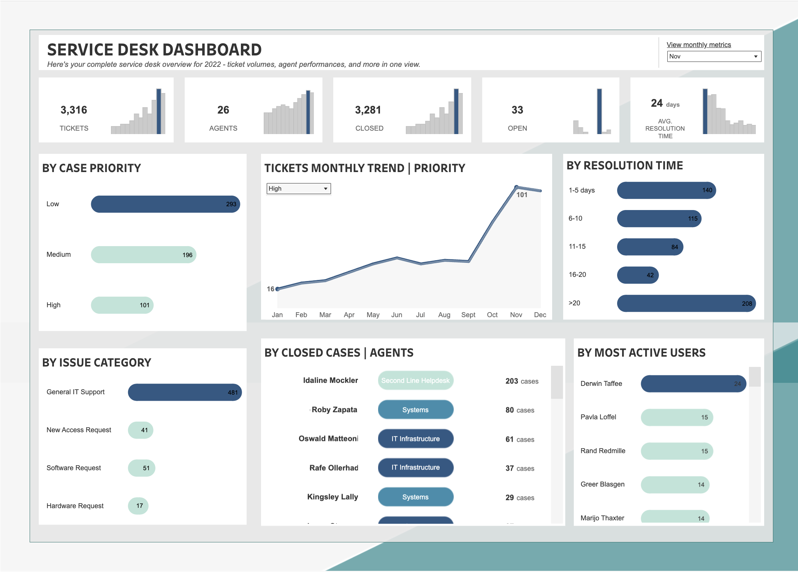

# 🖥️ Service Desk Dashboard — 2022 Annual Analysis

> **A complete service desk performance overview for 2022 — covering ticket volumes, agent productivity, resolution times, issue categories, and user activity trends.**

---

## 📋 Table of Contents

- [Project Overview](#project-overview)
- [Dashboard Preview](#dashboard-preview)
- [Metrics at a Glance](#metrics-at-a-glance)
- [Key Insights](#key-insights)
- [Ticket Priority Breakdown](#ticket-priority-breakdown)
- [Monthly Ticket Trend](#monthly-ticket-trend)
- [Resolution Time Analysis](#resolution-time-analysis)
- [Issue Category Distribution](#issue-category-distribution)
- [Agent Performance](#agent-performance)
- [Most Active Users](#most-active-users)
- [Tools & Technologies](#tools--technologies)
- [Repository Structure](#repository-structure)
- [Recommendations](#recommendations)

---

## 📌 Project Overview

This dashboard provides a comprehensive view of IT service desk operations for the full year **2022**. It tracks ticket inflows, resolution efficiency, agent workload, and user behavior — enabling data-driven decisions to improve SLA compliance, agent allocation, and overall support quality.

The data is filtered to **November** in the view shown, with year-to-date context visible through trend charts.

---

## 🖥️ Dashboard Preview



---

## 📊 Metrics at a Glance

| Metric | Value |
|---|---|
| **Total Tickets** | 3,316 |
| **Total Agents** | 26 |
| **Closed Tickets** | 3,281 |
| **Open Tickets** | 33 |
| **Ticket Closure Rate** | **98.9%** |
| **Avg. Resolution Time** | **24 days** |
| **High Priority Tickets** | 101 |
| **Medium Priority Tickets** | 196 |
| **Low Priority Tickets** | 293 |
| **Top Issue Category** | General IT Support — 481 cases |
| **Top Agent** | Idaline Mockler — 203 closed cases |
| **Most Active User** | Derwin Taffee |

---

## 💡 Key Insights

### 1. ✅ Near-Perfect Ticket Closure Rate
Of 3,316 total tickets, **3,281 were closed** — a closure rate of **98.9%**. Only **33 tickets remain open**, indicating a highly responsive and efficient service desk operation.

### 2. ⚠️ Average Resolution Time is High at 24 Days
While the closure rate is excellent, the **24-day average resolution time** is a concern. The largest resolution bucket is **>20 days (208 tickets)** — bigger than any other single range — suggesting a long tail of complex or stalled tickets dragging the average up significantly.

### 3. 📈 High Priority Tickets Surged in Nov–Dec
The monthly trend chart (filtered to High priority) shows a sharp spike from approximately **50 tickets in October to 101 in November** — nearly doubling month-over-month. This signals a system incident, product release, or seasonal demand increase that warrants root cause investigation.

### 4. 🗂️ Low Priority Dominates Volume
The ticket mix skews heavily toward lower urgency:
- **Low**: 293 tickets (49.6%)
- **Medium**: 196 tickets (33.2%)
- **High**: 101 tickets (17.1%)

Over 80% of tickets are Medium or Low priority — a healthy distribution. However, the high volume of Low-priority tickets may indicate preventable, recurring issues addressable through self-service resources.

### 5. 🧑‍💻 General IT Support Overwhelms Other Categories
**General IT Support accounts for 481 cases** — far exceeding all other categories (Software: 51, Access: 41, Hardware: 17). This catch-all category likely masks more granular issue types, and improving taxonomy could drive faster routing and resolution.

### 6. 🏆 Top Agent Handles 2.5× More Cases Than the Second
**Idaline Mockler closed 203 cases** in the Second Line Helpdesk — more than 2.5× the next agent (Roby Zapata, 80 cases). This concentration of workload is a risk: heavy dependency on one agent creates a bottleneck and a single point of failure.

### 7. 📉 The >20-Day Bucket is the Largest Resolution Group
The resolution time distribution reveals a **bimodal pattern** — fast resolutions (1–5 days: 140 tickets) and very slow ones (>20 days: 208 tickets). The >20-day group is the single largest, pointing to a specific class of complex tickets or broken escalation paths needing urgent process improvement.

---

## 🎫 Ticket Priority Breakdown

| Priority | Tickets | % of Total |
|---|---|---|
| 🔴 High | 101 | 17.1% |
| 🟡 Medium | 196 | 33.2% |
| 🟢 Low | 293 | 49.6% |
| **Total** | **590** *(Nov snapshot)* | **100%** |

> The healthy majority of Low/Medium tickets suggests most issues are non-critical. The November High-priority spike to 101 is the key outlier to monitor.

---

## 📅 Monthly Ticket Trend (High Priority)

| Period | High Priority Tickets | Trend |
|---|---|---|
| Jan | ~16 | Baseline |
| Feb–May | ~20–30 | Gradual rise |
| Jun–Aug | ~35–45 | Moderate growth |
| Sep–Oct | ~50–55 | Acceleration |
| **Nov** | **101** | **🔺 Sharp spike** |
| Dec | ~95 *(est.)* | Sustained high |

> A consistent upward trajectory throughout 2022 culminates in a dramatic November peak — likely tied to end-of-year IT changes, product releases, or system migrations.

---

## ⏱️ Resolution Time Analysis

| Resolution Time Band | Tickets | Notes |
|---|---|---|
| 1–5 days | 140 | Fast resolution |
| 6–10 days | 115 | Standard resolution |
| 11–15 days | 84 | Slightly delayed |
| 16–20 days | 42 | Approaching SLA breach |
| **> 20 days** | **208** | **⚠️ Largest bucket — critical** |

> The **>20 days bucket (208 tickets)** is the largest single group — larger even than the fastest "1–5 days" band. This long tail severely impacts the 24-day average and is the #1 improvement opportunity.

---

## 🗂️ Issue Category Distribution

| Category | Tickets | % of Total |
|---|---|---|
| General IT Support | **481** | **81.7%** |
| Software Request | 51 | 8.7% |
| New Access Request | 41 | 7.0% |
| Hardware Request | 17 | 2.9% |

> General IT Support is **7.9× larger** than the next category. This catch-all label likely hides actionable sub-issues. Enforcing sub-category selection at ticket creation could improve routing speed and trend visibility significantly.

---

## 👤 Agent Performance (Closed Cases — November)

| Rank | Agent | Team | Closed Cases |
|---|---|---|---|
| 🥇 | Idaline Mockler | Second Line Helpdesk | 203 |
| 🥈 | Roby Zapata | Systems | 80 |
| 🥉 | Oswald Matteoni | IT Infrastructure | 61 |
| 4 | Rafe Ollerhad | IT Infrastructure | 37 |
| 5 | Kingsley Lally | Systems | 29 |

> **Idaline Mockler** closed **46.8%** of the top 5 agents' combined output. This concentration presents a key-person risk — if unavailable, throughput would drop significantly across the Second Line team.

---

## 👥 Most Active Users

| User | Tickets Submitted |
|---|---|
| Derwin Taffee | ~24 *(highest)* |
| Pavla Loffel | 15 |
| Rand Redmille | 15 |
| Greer Blasgen | 14 |
| Marijo Thaxter | 14 |

> A small group of users generates a disproportionate share of ticket volume. Proactive outreach — dedicated walkthroughs, targeted documentation, or office hours — for these users could meaningfully reduce inbound ticket load.

---

## 🛠️ Tools & Technologies

| Tool | Purpose |
|---|---|
| **Power BI / Tableau** | Dashboard design and interactive filtering |
| **Excel / CSV** | Raw ticket data management |
| **Service Desk Platform** | Ticket ingestion (e.g., Jira Service Management, ServiceNow, Freshdesk) |
| **Markdown** | Documentation |

---

## 📁 Repository Structure

```
service-desk-dashboard/
│
├── data/
│   └── service_desk_2022.csv            # Raw ticket dataset
│
├── screenshots/
│   └── service_desk_dashboard.png       # Dashboard screenshot
│
├── analysis/
│   └── service_desk_analysis.ipynb      # EDA notebook (optional)
│
└── README.md                            # This file
```

---

## 🔮 Recommendations

1. **Investigate the November High-Priority Spike**
   A near-doubling of High-priority tickets (50 → 101) in a single month requires root cause analysis. Determine if this is a recurring year-end pattern or a one-time incident, and build contingency staffing plans accordingly.

2. **Tackle the >20-Day Resolution Backlog**
   With 208 tickets taking over 20 days to close, introduce formal escalation SLAs and weekly backlog reviews. Assign ownership for tickets stalled beyond 15 days to prevent continued drift.

3. **Redistribute Agent Workload**
   Idaline Mockler carries a disproportionate load. Implement round-robin assignment logic and cross-train additional Second Line Helpdesk agents to reduce key-person dependency.

4. **Improve Ticket Categorization**
   The 481 "General IT Support" tickets likely contain 5–10 hidden sub-categories. Enforce mandatory sub-category selection at ticket creation to enable better trend analysis and team routing.

5. **Proactive Support for Power Users**
   The top 5 users each submit 14–24 tickets. A targeted onboarding session, a personal knowledge base, or a dedicated support channel could cut their ticket volume by 30–50%.

6. **Build a Self-Service Knowledge Base**
   Given the dominance of Low-priority and General IT Support tickets, a structured FAQ or knowledge base could deflect an estimated 20–30% of inbound volume before it reaches an agent.

---

## 📜 License

This project is for educational and analytical purposes only. All ticket and agent data is anonymised.

---

*Service Desk Dashboard — 2022 Annual Review · README generated from dashboard visual analysis*
